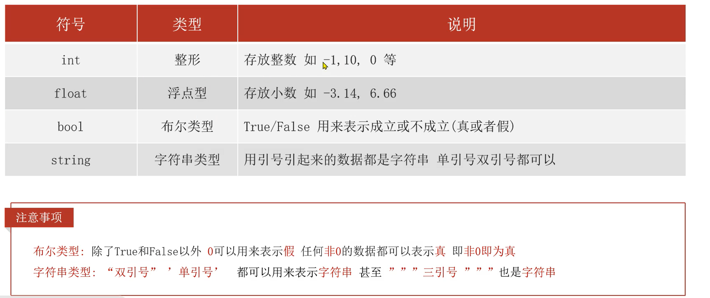

# Python数据类型

## 一、常用数据类型


## 二、整数（`int`）浮点数（`float`）字符串（`string`）

- 字符串都需要用英文的`"  "`包裹起来
- 

- **代码展示**

	```python
	a = 666  # 整型
	b = 13.14  # 浮点型
	c = "hello world"  # 字符串
	d = False	# 布尔类型
	# 输出打印
	print("整形：", a, "浮点型：", b, "字符串：", c)
	```
	
	注意：`bool`类型的数据`True`和`False`开头都要大写

## 三、查看数据类型`type()`语句

`type(被查看类型的数据)`

```python
a = 666  # 整型
b = 13.14  # 浮点型
c = "hello world"  # 字符串
d = True

# 查看某变量的数据类型
print(type(a))	# int
print(type(b))	# float
print(type(c))	# str
print(type(d))	# bool

# 也可
d = type(a)
print(d)
```


## 四、数据类型转换

- 概述：就是把值从`A`类型转成`B`类型，注意：有些值能转，有些值不能转

- 涉及到的函数有：

	- `int()`		把传入是值或变量名转成整数
	- `float()`    把传入是值或变量名转成小数
	- `str()`        把传入是值或变量名转成字符串
	- `bool()`      把传入是值或变量名转成布尔值，非0：True，0：False
	- `eval()`      相当于把引号去掉，是什么值，就是什么类型

- 演示：

	```python
	print(int("10"))		# 10
	print(int(10.2))		# 10
	print(int("10.2"))		# 报错
	print(int(True))		# 1
	
	print(float(10))		# 10.0
	print(float("10.2"))	# 10.2
	print(float(False))		# 0.0
	
	print(eval("10.2"))		# 10.2 float类型
	print(eval("10"))		# 10 int类型
	print(eval("False"))	# False bool类型
	print(eval("abc"))		# 报错
	```

	


