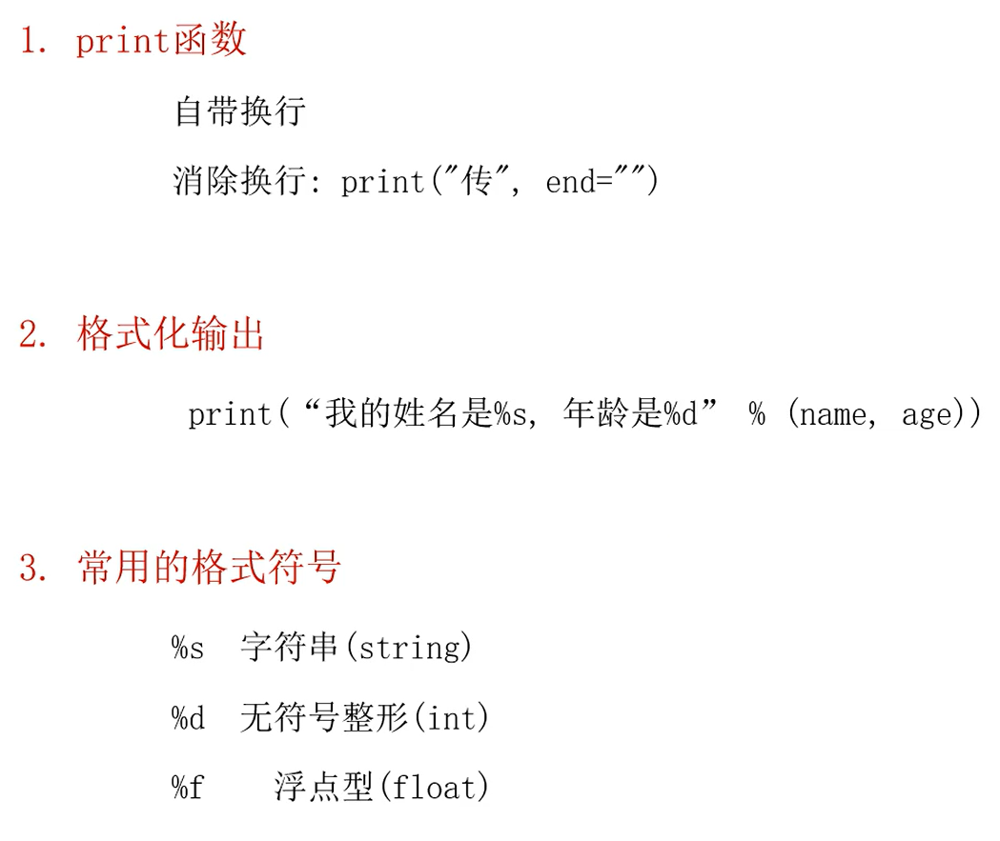

# Python格式化输出

 

```python
name = "张三"
age = 18
height = 180.1256
sid = 11  # 学生编号

# 输出不换行,不写end=‘’默认是\n换行转义符
print(name, end='')

# 一次性输出多个值
print(name, age, height)  # 张三 18 180.1256

print('-' * 31)  # 分割线

# 格式化输出  %s表示字符串  %d表示整数  %f表示小数
print("我的名字叫：%s" % name)  # 我的名字叫：张三

# 如果有多个占位符，填充时要用（）将变量框起来
print("我的名字叫：%s，今年%d岁，身高%fcm，编号是：%d" % (name, age, height, sid))
# 我的名字叫：张三，今年18岁，身高180.125600cm

# 默认填充
# 要求：身高保留两位小数，学生编号是五位，不够用0填充
print("我的名字叫：%s，今年%d岁，身高%.2fcm，编号是：%05d" % (name, age, height, sid))
# 我的名字叫：张三，今年18岁，身高180.13cm，编号是：00011
# 05d：表示数字是5位，位数不够用0填充，如果写5d，表示用默认的空格填充；  %.2f：表示保留两位小数
```


**四、插值表达式**

```python
# 格式：f"正常写内容即可，如果需要引入变量的值，用大括号包裹变量
print(f"我的名字叫：{name}，今年{age}岁，身高{height}cm，编号是：{sid}")
# 我的名字叫：张三，今年18岁，身高180.125600cm，编号是：11

# 要求：身高保留两位小数，学生编号是五位，不够用0填充
print(f"我的名字叫：{name}，今年{age}岁，身高{height:.2f}cm，编号是：{sid:05d}")
# 我的名字叫：张三，今年18岁，身高180.13cm，编号是：00011
# 可以通过键值对的方式去保留小数和控制位数
```


`round(x,2)`保留两位小数

`print("%.2f，%05d" % (height, sid))`保留小数和控制位数


